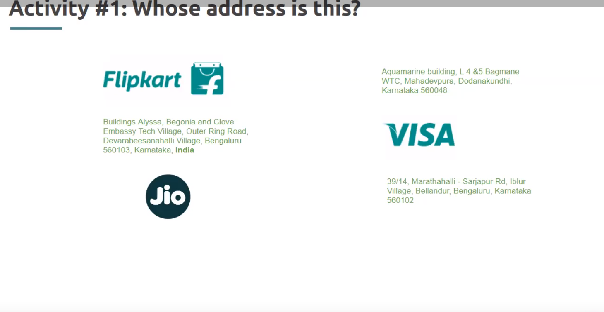
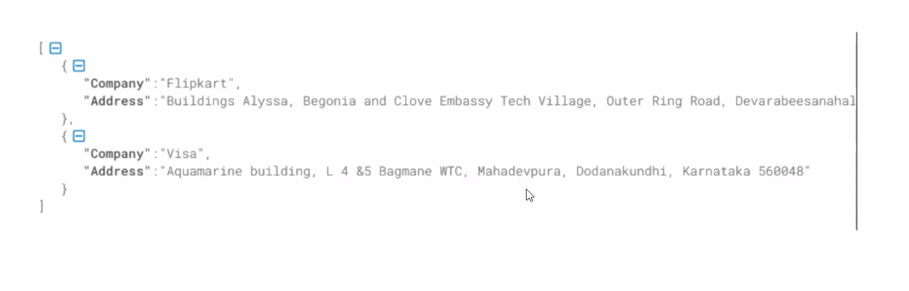

# CS Foundation Session 1

1. How do app comunicate with backend servers ?

API (Application Programming Interface): The backend server exposes a set of APIs that define the endpoints and methods for communication. APIs specify how the client app can interact with the server and request specific actions or retrieve data.

### What is REST API ?

- API is just a way for one pience of software to talk to another.
- APIs that conform to REST architectural style is called REST API.
- People generally refer REST APIS as REST over HTTP.

### HTTP & HTTPS

- HTTP and HTTPS is just a medium of communication.

### Request Methods

GET Method.

### Status Code

304: Viewing a cached data.

### Webpage

- Webpage consist of HTML, CSS, JavaScript, and images.

- HTTP returns text and HTML.

Question:

1. If crio creates a mobile app and wants to show all testimonials, can the same http request can be made ?

Yes, the same HTTP request can be used to fetch all testimonials from the backend server for a mobile app created by Crio. Typically, an HTTP GET request would be suitable for retrieving data, such as testimonials, from the server.

### Structured Vs UnStructured Data

Here we cant figure the address, because html is not structured.

Here we use JSON to structure the data. JSON is a structured data.

- REST API returns JSON data.
- Structured data can be easily understood and formatted. 
